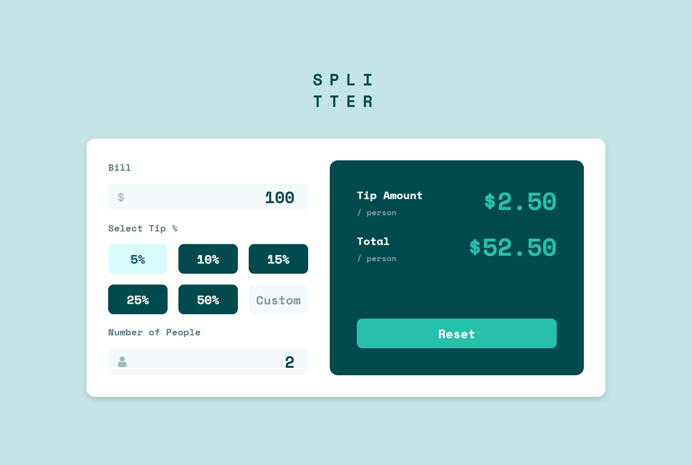

# Frontend Mentor - Tip calculator app solution

This is a solution to the [Tip calculator app challenge on Frontend Mentor](https://www.frontendmentor.io/challenges/tip-calculator-app-ugJNGbJUX). Frontend Mentor challenges help you improve your coding skills by building realistic projects.

## Table of contents

- [Frontend Mentor - Tip calculator app solution](#frontend-mentor---tip-calculator-app-solution)
  - [Table of contents](#table-of-contents)
  - [Overview](#overview)
    - [The challenge](#the-challenge)
    - [Screenshot](#screenshot)
    - [Links](#links)
  - [My process](#my-process)
    - [Built with](#built-with)
    - [Useful resources](#useful-resources)
  - [Author](#author)

## Overview

### The challenge

Users should be able to:

- View the optimal layout for the app depending on their device's screen size
- See hover states for all interactive elements on the page
- Calculate the correct tip and total cost of the bill per person

### Screenshot

### Links

- Solution URL: [Solution URL](https://github.com/Wolf-Root/Frontend-Mentor/tree/main/JavaScript-Fundamentals/Tip-Calculator-App)
- Live Site URL: [Live Site URL](https://wolf-root.github.io/Frontend-Mentor/JavaScript-Fundamentals/Tip-Calculator-App/)

## My process

### Built with

- Semantic HTML5 markup
- CSS custom properties
- Flexbox
- CSS Grid
- Mobile-first workflow
- [Tailwind CSS](https://tailwindcss.com/) - A utility-first CSS framework

### Useful resources

- [Tailwind CSS Documentation](https://tailwindcss.com/docs) - This helped me solve complex nesting and padding challenges within component cards. I found the utility-first approach for absolute positioning incredibly efficient and will be incorporating this pattern into my core

## Author

- Website - [Youssef](https://youssf.vercel.app)
- Frontend Mentor - [@Wolf-Root](https://www.frontendmentor.io/profile/Wolf-Root)
- Twitter - [@wolf_R00T](https://x.com/wolf_R00T)
